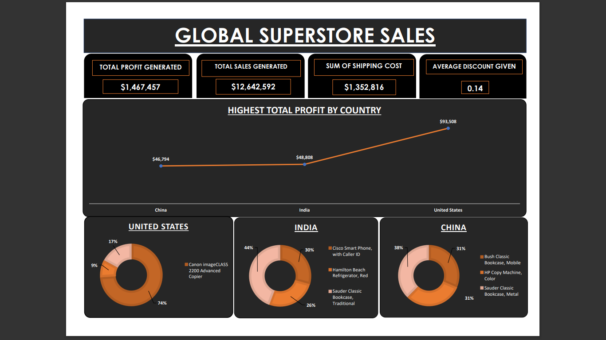
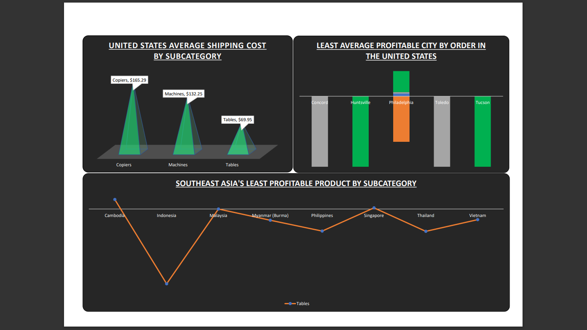
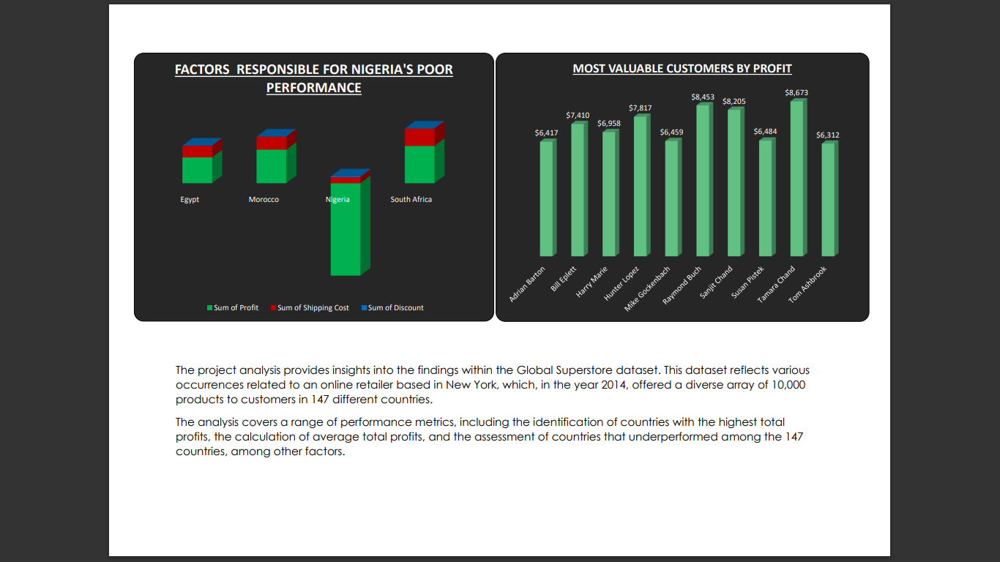
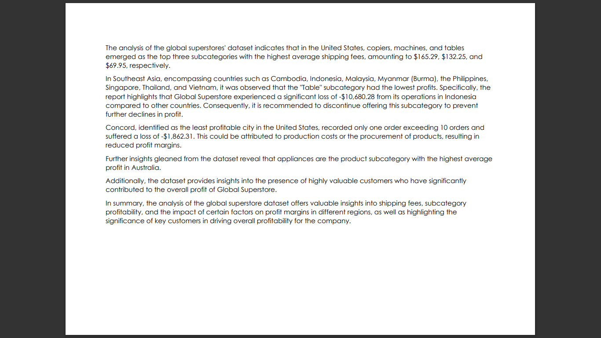
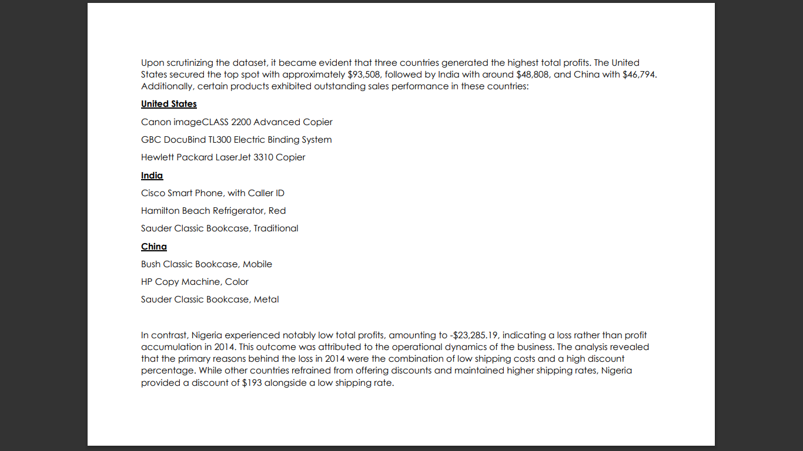

# GlobalSuperstore

## Introduction

This is a power Bi project on sales analysis of a global online retailer called **Global Superstore**. 
The project is to analyze and draw out meaningful insight from the Superstore dataset which would aid management in making informed decisions to improve performance and profitability.

**_Disclaimer_** : _All datasets and reports do not represent any company, institution or country, dummy dataset to demonstrate capabilities of Power BI._

## Problem statement

1.  Who is the most valuable customers and what do they purchase?
2.  Which product subcategory has the highest average profit in Australia?
3.  Which city is the least profitable (in terms of average profit) in the United States?
4.  Identify the 3 subcategories with the highest average shipping cost in the United States.

## Skills/ concepts demonstrated:

The following Power BI features were incorporated:  
- Data cleaning
- Data modelling
- Visualization
- Pivot table
- Generating insight

## Visualization

The report comprises 0f 5 pages:
1. countries profit
2. customers profit
3. subcategories
4. customer analysis
5. customer analysis 2

### Countries profit:

-  Total profit generated is $1,467,457.
-  sum of shipping cost is $1,352,816.

### Subcategories

-  Least profitable city in usa is concord.
-  "Table" subcategory has the lowest profit while copiers has the highest.

### customers profit

-  The most valuable customer is Raymond Buch with $8,453 purchased
## Analysis:

### customer analysis i

-  There are 10,000 products to customers in 147 countries.

### customer analysis ii
 
-  Nigeria experienced loss total profit in 2014 because of low shipping cost and discount percentage(%)

## Conclusion and Recommendation:

#Conclusion:
The analysis of the global superstore dataset offers valuable insights into shipping fees, subcategory profitability, and the impact of certain factors on profit margins in different regions, as well as highlighting the significance of key customers in driving overall profitability for the company.

#Recommendation: 
For a deep dive into the analytics, the datasets of the previous years will ne required for comparison and driven decision making. 

